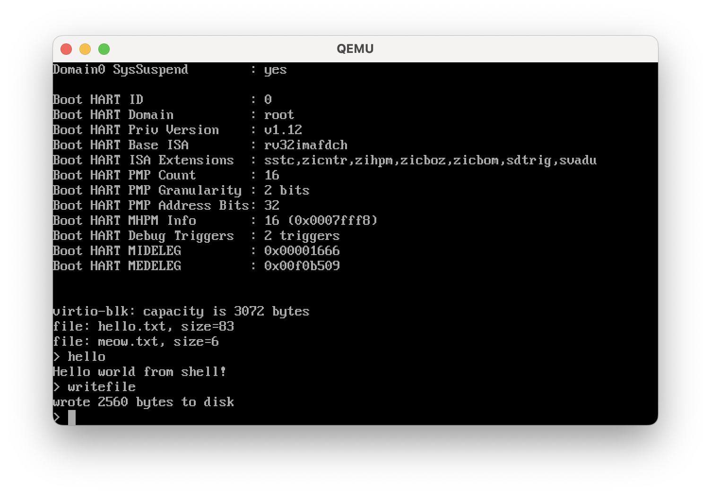

# Writing an Operating System in 1,000 Lines

**[English](https://operating-system-in-1000-lines.vercel.app/en)** ∙ **[日本語](https://operating-system-in-1000-lines.vercel.app/ja/)** ∙ **[简体中文](https://operating-system-in-1000-lines.vercel.app/zh/)** *(translated by [@YianAndCode](https://github.com/YianAndCode))* ∙ **[한국어](https://operating-system-in-1000-lines.vercel.app/ko/)** *(translated by [@JoHwanhee](https://github.com/JoHwanhee))*

This repository contains the source code for the website [Operating System in 1,000 Lines](https://operating-system-in-1000-lines.vercel.app/), and a reference implementation.

## More interesting implementations

The book only covers the basics of an operating system. You can do more with the knowledge you have gained. Here are some ideas:

| Implementation | Author |
| --- | --- |
| [Shutdown command](https://github.com/nuta/operating-system-in-1000-lines/pull/59/files) | [@calvera](https://github.com/calvera) |

Let me know if you have implemented something interesting!
