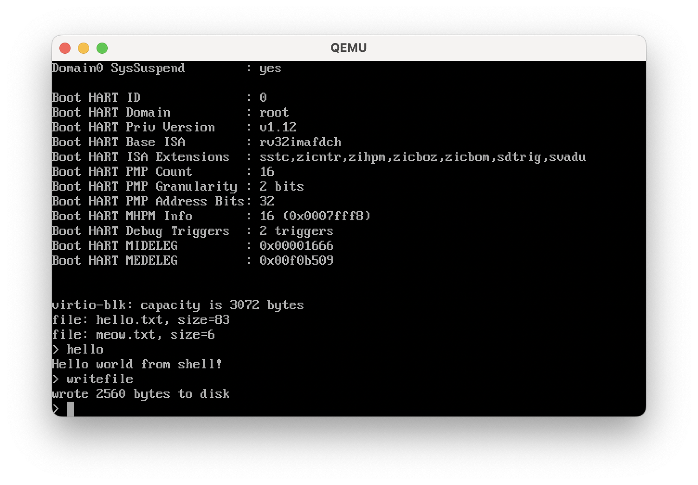

# Writing an Operating System in 1,000 Lines

**[English](https://1000os.seiya.me/en)** ∙ **[日本語](https://1000os.seiya.me/ja/)** ∙ **[简体中文](https://1000os.seiya.me/zh/)** *(translated by [@YianAndCode](https://github.com/YianAndCode))* ∙ **[한국어](https://1000os.seiya.me/ko/)** *(translated by [@JoHwanhee](https://github.com/JoHwanhee))* ∙ **[繁體中文](https://1000os.seiya.me/tw/)** *(translated by [@alanhc](https://github.com/alanhc))*

This repository contains the source code for the website [Operating System in 1,000 Lines](https://1000os.seiya.me/), and a reference implementation.

## More interesting implementations

The book only covers the basics of an operating system. You can do more with the knowledge you have gained. Here are some ideas:

| Implementation | Author |
| --- | --- |
| [Shutdown command](https://github.com/nuta/operating-system-in-1000-lines/pull/59/files) | [@calvera](https://github.com/calvera) |
| [Creating files, and reading/writing files at arbitrary names](https://github.com/nuta/operating-system-in-1000-lines/pull/110) | [@CagriAtalar](https://github.com/CagriAtalar) |
| [Hierarchical filesystem, persistent storage, TAB completion, rm -r, proper reboot/shutdown](https://github.com/alicangnll) | [@alicangnll](https://github.com/alicangnll) |

## Features Implemented

This implementation includes the following features while staying under 1,000 lines:

### File System
- **Hierarchical filesystem** with directories and files
- **Persistent storage** using tar format (files survive reboots)
- **File operations**: `touch`, `cat`, `rm` (with `-r` for recursive deletion)
- **Directory operations**: `mkdir`, `cd`, `ls`, `pwd`
- **Path handling**: Supports both absolute (`/path/to/file`) and relative (`path/to/file`) paths
- **Duplicate prevention**: Cannot create files/directories with existing names

### Shell Features
- **TAB completion**: Press TAB to autocomplete commands (help, hello, exit, pwd, cd, mkdir, ls, cat, touch, rm, echo, clear, shutdown, reboot)
- **Backspace support**: Delete characters with backspace key
- **Command history**: Shows appropriate error messages
- **Working directory**: Tracks current directory with `pwd` and `cd` commands

### System Commands
- **help** - Show available commands
- **hello** - Print test message
- **clear** - Clear screen
- **echo** - Display text
- **exit** - Exit shell
- **shutdown** - Properly shutdown the system (SBI call 0x02)
- **reboot** - Properly reboot the system (SBI call 0x01)

### Technical Details
- **1,000 lines exactly** - Meets the line limit constraint
- **RISC-V 32-bit** architecture
- **VirtIO block device** for persistent storage
- **Tar format** for disk image compatibility
- **Parent-child relationships** for hierarchical file structure
- **8 file/directory slots** with dynamic allocation

Let me know if you have implemented something interesting!
